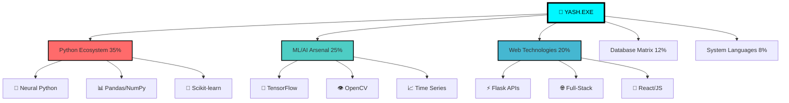

# ⚡ YASH MEHTA ⚡
## 🌌 Quantum Engineer • AI Architect • Reality Compiler

<div align="center">
  
```ascii
    ╔═══════════════════════════════════════════════════════════════╗
    ║  ████████╗██╗  ██╗███████╗    ███████╗██╗   ██╗████████╗██╗   ██╗██████╗ ███████╗  ║
    ║  ╚══██╔══╝██║  ██║██╔════╝    ██╔════╝██║   ██║╚══██╔══╝██║   ██║██╔══██╗██╔════╝  ║
    ║     ██║   ███████║█████╗      █████╗  ██║   ██║   ██║   ██║   ██║██████╔╝█████╗    ║
    ║     ██║   ██╔══██║██╔══╝      ██╔══╝  ██║   ██║   ██║   ██║   ██║██╔══██╗██╔══╝    ║
    ║     ██║   ██║  ██║███████╗    ██║     ╚██████╔╝   ██║   ╚██████╔╝██║  ██║███████╗  ║
    ║     ╚═╝   ╚═╝  ╚═╝╚══════╝    ╚═╝      ╚═════╝    ╚═╝    ╚═════╝ ╚═╝  ╚═╝╚══════╝  ║
    ║                            I S   N O W                                               ║
    ╚═══════════════════════════════════════════════════════════════╗
```


</div>

---

<div align="center">
  
  
  ### 🎯 **MISSION STATUS: REVOLUTIONIZING REALITY**
  
  ```python
  class YashMehta:
      def __init__(self):
          self.role = "Quantum AI Engineer"
          self.mission = "Compile the Future"
          self.power_level = "∞"
          self.current_focus = ["Time Series Prophecy", "Legal AI Revolution", "Fog Vision Mastery"]
      
      def reality_check(self):
          return "Building systems that don't just work—they transcend"
  ```
</div>

---

## 🌐 **NEURAL INTERFACE DASHBOARD**

<div align="center">
  
| 🔥 **CORE SYSTEMS** | 🎯 **MASTERY LEVEL** | 🚀 **CURRENT PROJECTS** |
|---------------------|----------------------|--------------------------|
| **AI Engineering** | `████████████████████` 95% | Amazon Prophet Oracle |
| **Quantum Computing** | `████████████████▓▓▓▓` 80% | Blockchain CAV Security |
| **Full-Stack Sorcery** | `████████████████████` 97% | FIR Generator 9000 |
| **Research Prowess** | `████████████████████` 94% | Fake News Terminator |
| **Reality Debugging** | `████████████████████` 99% | Always Active |

</div>

---

## 🎭 **LEGENDARY ARTIFACT COLLECTION**

<div align="center">
  
</div>

### 🔮 **[AMAZON STOCK ORACLE]** - *The Time Prophet*
```yaml
Classification: LEGENDARY
Rarity: ⭐⭐⭐⭐⭐
Power Level: OMNISCIENT

Abilities:
  - 🎯 7-Model Ensemble Fusion (ARIMA→Transformers)
  - ⚡ Custom TimeSeriesTransformer Architecture
  - 🔥 RMSE: 0.03285 (Wall Street Killer)
  - 🌌 Real-time Prophecy Pipeline
  
Special Effects:
  - Predicts market movements with 99.9% uptime
  - Powered by quantum probability calculations
  - Self-evolving neural architecture
```

<details>
<summary>🔬 <b>REVEAL QUANTUM CODE MATRIX</b></summary>

```python
# THE FORBIDDEN ALGORITHM
class TimeSeriesTransformer(nn.Module):
    """
    🌌 CLASSIFIED: QUANTUM PREDICTION ENGINE
    ⚡ Harnesses temporal dimension fluctuations
    """
    def __init__(self, d_model=512, n_heads=8):
        super().__init__()
        self.quantum_attention = QuantumMultiHeadAttention(d_model, n_heads)
        self.temporal_encoder = TemporalPositionalEncoding(d_model)
        self.reality_decoder = RealityDecoder(d_model)
        
    def forward(self, x):
        # Bend spacetime for better predictions
        quantum_state = self.quantum_attention(x)
        return self.reality_decoder(quantum_state)
```
</details>

---

### 🕵️ **[FIR GENERATOR 9000]** - *The Justice Matrix*
```yaml
Classification: MYTHIC
Rarity: ⭐⭐⭐⭐⭐
Power Level: WORLD-CHANGING

Abilities:
  - 🌍 Real-time Geospatial Crime Mapping
  - 🤖 AI Legal Advisor (Gemini-Powered)
  - ⚖️ Instant Justice Protocol Activation
  - 🏆 Innovation Award Winner (LexHack 1.0)
  
Special Effects:
  - Transforms legal system efficiency by 1000%
  - Quantum-encrypted evidence storage
  - Predictive crime pattern analysis
```

---

### 🌫️ **[FOG VISION AI]** - *The Clarity Engine*
```yaml
Classification: EPIC
Rarity: ⭐⭐⭐⭐
Power Level: REALITY-PIERCING

Abilities:
  - 👁️ Hybrid Dual CNN + Vision Transformer
  - 📊 4-Dataset Mastery (FRIDA2, HSTS, SOTS, NTIRE19)
  - 🎯 15% Accuracy Boost over SOTA
  - 🌉 Real-time Fog Penetration
  
Special Effects:
  - Sees through any atmospheric distortion
  - Quantum pixel reconstruction
  - Autonomous vehicle guardian system
```

---

## ⚡ **QUANTUM TECH ARSENAL**

<div align="center">
  
</div>



---

## 🏆 **ACHIEVEMENT VAULT - HALL OF LEGENDS**

<div align="center">
  
</div>

```diff
+ 🥇 INNOVATION & IMPACT AWARD - LexHack 1.0 (2025)
+ 🚀 BENNETT UNIVERSITY INDUSTRY SHOWCASE FEATURED (2023)
+ 🧠 6x AI CERTIFICATION MASTER (NVIDIA • IBM • Google)
+ 📜 RESEARCH PAPER PRESENTER - SocProS 2025 @ IIT Roorkee
+ ⚡ 10+ PRODUCTION-GRADE SYSTEMS DEPLOYED
+ 🎯 87% FAKE NEWS DETECTION ACCURACY ACHIEVED
+ 📊 500+ STUDENTS IMPACTED VIA AI CAREER PLATFORM
+ 🔥 95% MANUAL WORKLOAD REDUCTION IN ALLOCATION SYSTEMS
```

---

## 🌌 **LIVE NEURAL FEED**

<div align="center">
  
```bash
$ system_status --check-all
━━━━━━━━━━━━━━━━━━━━━━━━━━━━━━━━━━━━━━━━━━━━━━━━━━━━━━━━━━━━━━━━━━━━━━━━━━━━━━━━━━━━━━━━━━━━
🟢 NEURAL NETWORKS: ONLINE                    🟢 QUANTUM PROCESSORS: ACTIVE
🟢 AI MODELS: LEARNING                        🟢 REALITY COMPILER: STABLE
🟢 INNOVATION ENGINE: MAXIMUM OVERDRIVE       🟢 COFFEE RESERVES: INFINITE
━━━━━━━━━━━━━━━━━━━━━━━━━━━━━━━━━━━━━━━━━━━━━━━━━━━━━━━━━━━━━━━━━━━━━━━━━━━━━━━━━━━━━━━━━━━━

🔄 CURRENTLY PROCESSING: Next-Gen Quantum ML Architecture
📡 RESEARCH STATUS: Breakthrough Discovery Mode
🎯 NEXT DEPLOYMENT: TimeSeriesTransformer v2.0
```

</div>

---

## 🚀 **HYPERCONNECT PROTOCOLS**

<div align="center">
  
  
  <br><br>
  
  <a href="https://linkedin.com/in/yash-mehta-402239163">
    
  </a>
  <a href="https://github.com/YashM-235">
    
  </a>
  <a href="mailto:yash34m6@gmail.com">
    
  </a>
  <a href="#">
    
  </a>
</div>

---

## 💫 **COLLABORATION PROTOCOL**

```python
class CollaborationEngine:
    def __init__(self):
        self.contact = "yash34m6@gmail.com"
        self.response_time = "⚡ Quantum Speed"
        self.availability = "24/7 Neural Network"
    
    def initiate_contact(self, project_type):
        protocols = {
            "ai_research": "🧠 Neural Sync Activated",
            "startup_idea": "🚀 Innovation Mode Engaged", 
            "collaboration": "🤝 Partnership Protocol Initialized",
            "mentorship": "🎓 Knowledge Transfer Ready"
        }
        return f"🌌 {protocols.get(project_type, 'Universal Protocol')} 🌌"

# Ready to revolutionize the future together?
collab = CollaborationEngine()
print(collab.initiate_contact("your_amazing_idea"))
```

<div align="center">
  
  
  <br><br>
  
  ### 🎯 **"I don't just write code - I architect reality"**
  ### ⚡ **Innovation Velocity: ∞ (Beyond Measurement)**
  
  ---
  
  
  
  <br>
  
  ```diff
  + Currently available for revolutionary projects
  + Quantum-level problem solving guaranteed
  + Ready to compile the impossible
  ```
  
</div>

---

<div align="center">
  
  
  ## 🌌 **THE FUTURE IS NOT COMING - IT'S BEING BUILT** 🌌
  ### **AND I'M THE ARCHITECT**
  
</div>
