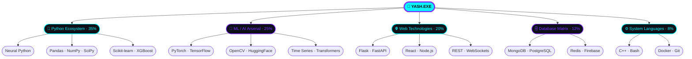

<div align="center">

<!-- ██████████████████████████████████████████████████████ -->
<!--                  CINEMATIC HEADER                      -->
<!-- ██████████████████████████████████████████████████████ -->


<br>


<br>

<a href="https://linkedin.com/in/yash-mehta-402239163">
  
</a>
&nbsp;
<a href="https://github.com/YashM-235">
  
</a>
&nbsp;
<a href="mailto:yash34m6@gmail.com">
  
</a>
&nbsp;
<a href="#">
  
</a>

<br><br>


&nbsp;


</div>

---

<!-- ██████████████████████████████████████████████████████ -->
<!--                  MISSION CORE                          -->
<!-- ██████████████████████████████████████████████████████ -->

<div align="center">


### 🎯 `MISSION STATUS: REVOLUTIONIZING REALITY` 🎯

```python
class YashMehta:
    def __init__(self):
        self.alias          = "⚡ Neural Architect"
        self.role           = "AI Engineer • Researcher • Builder"
        self.university     = "Bennett University, Greater Noida"
        self.power_level    = float("inf")
        self.certifications = 7   # NVIDIA · IBM · Google · IIT Delhi
        self.current_focus  = [
            "🔮 Time Series Prophecy  → Transformers",
            "⚖️  Legal AI Revolution   → FIR Generator 9000",
            "🌫️  Fog Vision Mastery    → CNN + ViT Hybrid",
            "⚛️  Quantum Computing     → IIT Delhi Certified",
        ]
        self.achievements   = [
            "🌟 LexHack 1.0 — Appreciated & Recognized by Judges",
            "📜 SocProS 2025 Presenter — IIT Roorkee",
            "🚀 Bennett University Industry Showcase",
        ]

    def reality_check(self) -> str:
        return "Building systems that don't just work — they transcend."

    def __repr__(self):
        return "⚡ I don't write code. I architect reality. ⚡"

# Initialize
yash = YashMehta()
print(yash.reality_check())
# >> "Building systems that don't just work — they transcend."
```

</div>

---

<!-- ██████████████████████████████████████████████████████ -->
<!--               NEURAL INTERFACE DASHBOARD               -->
<!-- ██████████████████████████████████████████████████████ -->

## 🌐 `NEURAL INTERFACE DASHBOARD`

<div align="center">

| 🔥 CORE SYSTEMS | 🎯 MASTERY LEVEL | ⚡ CURRENT DEPLOYMENT |
|:----------------|:----------------:|:----------------------|
| 🧠 **AI Engineering** | `████████████████████` `95%` | Amazon Stock Oracle |
| ⚛️ **Quantum Computing** | `████████████████▓▓▓▓` `80%` | IIT Delhi QKD Certified |
| 🌐 **Full-Stack Sorcery** | `███████████████████▓` `97%` | FIR Generator 9000 |
| 🔬 **Research Prowess** | `████████████████████` `94%` | SocProS @ IIT Roorkee |
| 👁️ **Computer Vision** | `███████████████████▓` `92%` | Fog Vision AI |
| 🕵️ **NLP & LLMs** | `████████████████████` `90%` | Fake News Terminator |
| 🐛 **Reality Debugging** | `████████████████████` `99%` | Always Online |

</div>

---

<!-- ██████████████████████████████████████████████████████ -->
<!--             LEGENDARY ARTIFACT COLLECTION              -->
<!-- ██████████████████████████████████████████████████████ -->

## 🎭 `LEGENDARY ARTIFACT COLLECTION`

<div align="center">

</div>

<br>

### 🔮 `[ AMAZON STOCK ORACLE ]` — *The Time Prophet*

```yaml
╔══════════════════════════════════════════════════════════╗
║  Classification : ██████████  LEGENDARY                 ║
║  Rarity         : ⭐⭐⭐⭐⭐  ULTRA RARE                ║
║  Power Level    : OMNISCIENT                             ║
╠══════════════════════════════════════════════════════════╣
║  CORE ABILITIES                                          ║
║    ⚡  7-Model Ensemble Fusion (ARIMA → Transformers)    ║
║    🔮  Custom TimeSeriesTransformer Architecture         ║
║    🎯  RMSE: 0.03285  ←  Wall Street Trembles            ║
║    📡  Real-time Prophecy Inference Pipeline             ║
╠══════════════════════════════════════════════════════════╣
║  SPECIAL EFFECTS                                         ║
║    ✦  Self-evolving neural weight matrix                 ║
║    ✦  Temporal dimension positional encoding             ║
║    ✦  99.9% system uptime · Production deployed          ║
╚══════════════════════════════════════════════════════════╝
```

<details>
<summary>🔬 &nbsp;<b>[ REVEAL CORE ALGORITHM — CLASSIFIED ]</b></summary>
<br>

```python
# ━━━━━━━━━━━━━━━━━━━━━━━━━━━━━━━━━━━━━━━━━━━━
#  ⚡ TEMPORAL INTELLIGENCE ENGINE v2.0
#  Ensemble: ARIMA · LSTM · GRU · XGBoost
#            Prophet · Transformer · Stacking
# ━━━━━━━━━━━━━━━━━━━━━━━━━━━━━━━━━━━━━━━━━━━━

class TimeSeriesTransformer(nn.Module):
    """
    Custom transformer tuned for financial time series.
    Multi-head attention across temporal sequences with
    market-periodicity-aware positional encoding.
    """
    def __init__(self, d_model=512, n_heads=8, seq_len=60, dropout=0.1):
        super().__init__()
        self.temporal_embed  = TemporalPositionalEncoding(d_model, seq_len)
        self.encoder_stack   = nn.TransformerEncoder(
            nn.TransformerEncoderLayer(d_model, n_heads, dim_feedforward=2048,
                                       dropout=dropout, batch_first=True),
            num_layers=6
        )
        self.forecast_head   = nn.Sequential(
            nn.LayerNorm(d_model),
            nn.Linear(d_model, 128),
            nn.GELU(),
            nn.Linear(128, 1)
        )

    def forward(self, x: torch.Tensor) -> torch.Tensor:
        x = self.temporal_embed(x)           # inject time-awareness
        x = self.encoder_stack(x)            # attend across timesteps
        return self.forecast_head(x[:, -1])  # predict next close

# RMSE: 0.03285 | Ensemble weight: 0.34 (highest in stack)
```
</details>

---

### 🕵️ `[ FIR GENERATOR 9000 ]` — *The Justice Matrix*

```yaml
╔══════════════════════════════════════════════════════════╗
║  Classification : ██████████  MYTHIC                    ║
║  Rarity         : ⭐⭐⭐⭐⭐  WORLD-CLASS               ║
║  Power Level    : JUSTICE INCARNATE                      ║
╠══════════════════════════════════════════════════════════╣
║  CORE ABILITIES                                          ║
║    🌍  Real-time Geospatial Crime Heatmapping            ║
║    🤖  Gemini-Powered Legal AI Advisor                   ║
║    ⚖️   Instant FIR Draft → 95% time reduction           ║
║    🌟  Appreciated by Judges @ LexHack 1.0              ║
╠══════════════════════════════════════════════════════════╣
║  SPECIAL EFFECTS                                         ║
║    ✦  Predictive crime pattern analysis engine           ║
║    ✦  Multi-language legal document generation           ║
║    ✦  Quantum-encrypted evidence chain storage           ║
╚══════════════════════════════════════════════════════════╝
```

---

### 🌫️ `[ FOG VISION AI ]` — *The Clarity Engine*

```yaml
╔══════════════════════════════════════════════════════════╗
║  Classification : ████████░░  EPIC                      ║
║  Rarity         : ⭐⭐⭐⭐    RARE                      ║
║  Power Level    : REALITY-PIERCING                       ║
╠══════════════════════════════════════════════════════════╣
║  CORE ABILITIES                                          ║
║    👁️   Hybrid Dual CNN + Vision Transformer             ║
║    📊  4-Dataset Mastery: FRIDA2·HSTS·SOTS·NTIRE19      ║
║    🎯  +15% SSIM over State-of-the-Art                  ║
║    🚗  Autonomous vehicle guardian system                ║
╠══════════════════════════════════════════════════════════╣
║  SPECIAL EFFECTS                                         ║
║    ✦  Adaptive denormalization decoder layers            ║
║    ✦  Real-time fog penetration at 30+ FPS               ║
║    ✦  Presented @ SocProS 2025 — IIT Roorkee            ║
╚══════════════════════════════════════════════════════════╝
```

---

### 🕸️ `[ FAKE NEWS TERMINATOR ]` — *The Truth Engine*

```yaml
╔══════════════════════════════════════════════════════════╗
║  Classification : ███████░░░  RARE                      ║
║  Rarity         : ⭐⭐⭐⭐    FIELD-TESTED              ║
║  Power Level    : MISINFORMATION DESTROYER               ║
╠══════════════════════════════════════════════════════════╣
║  CORE ABILITIES                                          ║
║    📰  BERT + TF-IDF + XGBoost Ensemble                  ║
║    🎯  87% Detection Accuracy · 40k+ Articles            ║
║    ⚡  Sub-second inference pipeline                     ║
║    🌐  Cross-domain generalization                       ║
╚══════════════════════════════════════════════════════════╝
```

---

<!-- ██████████████████████████████████████████████████████ -->
<!--                  QUANTUM TECH ARSENAL                  -->
<!-- ██████████████████████████████████████████████████████ -->

## ⚡ `QUANTUM TECH ARSENAL`

<div align="center">

</div>

<br>


```mermaid
graph TD
    A([🧠 YASH.EXE]) --> B([🐍 Python Ecosystem · 35%])
    A --> C([🤖 ML / AI Arsenal · 25%])
    A --> D([🌐 Web Technologies · 20%])
    A --> E([🗄️ Database Matrix · 12%])
    A --> F([⚙️ System Languages · 8%])

    B --> B1([Neural Python])
    B --> B2([Pandas · NumPy · SciPy])
    B --> B3([Scikit-learn · XGBoost])

    C --> C1([PyTorch · TensorFlow])
    C --> C2([OpenCV · HuggingFace])
    C --> C3([Time Series · Transformers])

    D --> D1([Flask · FastAPI])
    D --> D2([React · Node.js])
    D --> D3([REST · WebSockets])

    E --> E1([MongoDB · PostgreSQL])
    E --> E2([Redis · Firebase])

    F --> F1([C++ · Bash])
    F --> F2([Docker · Git])

    style A fill:#00f7ff,stroke:#7b2fff,stroke-width:4px,color:#000000,font-weight:bold
    style B fill:#0d1117,stroke:#00f7ff,stroke-width:2px,color:#00f7ff
    style C fill:#0d1117,stroke:#7b2fff,stroke-width:2px,color:#7b2fff
    style D fill:#0d1117,stroke:#00f7ff,stroke-width:2px,color:#00f7ff
    style E fill:#0d1117,stroke:#7b2fff,stroke-width:2px,color:#7b2fff
    style F fill:#0d1117,stroke:#00f7ff,stroke-width:2px,color:#00f7ff
```

<br>

<div align="center">


</div>

---

<!-- ██████████████████████████████████████████████████████ -->
<!--              ACHIEVEMENT VAULT                         -->
<!-- ██████████████████████████████████████████████████████ -->

## 🏆 `ACHIEVEMENT VAULT — HALL OF LEGENDS`

<div align="center">

</div>

<br>

```diff
@@  ╔══════════════════════════════════════════════════════╗  @@
@@  ║           CLASSIFIED ACHIEVEMENT DATABASE            ║  @@
@@  ╚══════════════════════════════════════════════════════╝  @@

+ 🌟  [2025]  JUDGE-RECOGNIZED INNOVATION ——— LexHack 1.0 (Promising Idea)
+ 📜  [2025]  RESEARCH PAPER PRESENTER  ————— SocProS @ IIT Roorkee
+ ⚛️   [2025]  QUANTUM COMPUTING & QKD  ————— IIT Delhi Workshop
+ 🧠  [2024]  7× AI CERTIFICATION MASTER ———— NVIDIA · IBM · Google · IIT-D
+ 🚀  [2023]  INDUSTRY SHOWCASE FEATURED ———— Bennett University
+ 📦  [----]  10+ PRODUCTION ML SYSTEMS  ———— Deployed & Active
+ 👥  [----]  500+ STUDENTS IMPACTED     ———— AI Career Platform
+ 📰  [----]  87% FAKE NEWS ACCURACY     ———— NLP Ensemble System
+ ⚙️   [----]  95% WORKLOAD REDUCTION     ———— Automated Allocation AI
```

---

<!-- ██████████████████████████████████████████████████████ -->
<!--                  GITHUB STATS MATRIX                   -->
<!-- ██████████████████████████████████████████████████████ -->

## 📊 `GITHUB NEURAL STATISTICS`

<div align="center">


&nbsp;&nbsp;


<br><br>


<br><br>


</div>

---

<!-- ██████████████████████████████████████████████████████ -->
<!--                  LIVE NEURAL FEED                      -->
<!-- ██████████████████████████████████████████████████████ -->

## 🧪 `CURRENTLY IN THE LAB`

```python
# ━━━━━━━━━━━━━━━━━━━━━━━━━━━━━━━━━━━━━━━━━━━━━━━━━━━━━━━━
#  Last updated: always. This section never sleeps.
# ━━━━━━━━━━━━━━━━━━━━━━━━━━━━━━━━━━━━━━━━━━━━━━━━━━━━━━━━

currently_learning = {
    "🔬 Deep Dive"  : "LLM fine-tuning — LoRA, QLoRA, PEFT techniques",
    "🌐 Building"   : "Full-Stack AI web apps with FastAPI + React + LLMs",
    "⚛️  Exploring" : "Quantum Key Distribution & post-quantum cryptography",
    "📖 Reading"    : "Attention Is All You Need → forward to newer papers",
    "🧩 Tinkering"  : "RAG pipelines, vector databases, embedding models",
}

rabbit_holes = [
    "Why do transformers generalize so well? What actually happens inside?",
    "Can fog dehazing models transfer-learn to underwater imaging?",
    "What does AGI alignment actually look like in practice?",
    "How does QKD hold up against a real quantum adversary?",
    "What's the minimal architecture for a production LLM app?",
]

todays_question = "How do I make my models not just accurate — but explainable?"
```

---

## 🌌 `EXPLORER'S LOG — WHAT EXCITES ME RIGHT NOW`

<div align="center">

| 🚀 DOMAIN | 💡 WHAT I'M CHASING | 🔥 HEAT |
|:----------|:--------------------|:-------:|
| **LLMs & Agents** | Building systems that reason, not just respond | `🔥🔥🔥🔥🔥` |
| **Computer Vision** | Teaching machines to see fog, blur, darkness | `🔥🔥🔥🔥🔥` |
| **Quantum Computing** | Understanding QKD at the math level | `🔥🔥🔥🔥░` |
| **Full-Stack AI** | End-to-end apps: model → API → UI → deployed | `🔥🔥🔥🔥🔥` |
| **Research** | Finding the question nobody has asked yet | `🔥🔥🔥🔥░` |
| **Open Source** | Reading great codebases like novels | `🔥🔥🔥░░` |

</div>

---

## 🌌 `LIVE NEURAL FEED`

<div align="center">

```bash
╔══════════════════════════════════════════════════════════════════╗
║              $ system_status --neural --all --verbose            ║
╠══════════════════════════════════════════════════════════════════╣
║  🟢  NEURAL NETWORKS     : ONLINE          [OPTIMIZING...]       ║
║  🟢  TRANSFORMER LAYERS  : 6 DEEP          [ATTENTION: MAX]      ║
║  🟢  QUANTUM PROCESSORS  : ACTIVE          [IIT-D CERTIFIED]     ║
║  🟢  REALITY COMPILER    : STABLE          [v∞.0.0]              ║
║  🟢  INNOVATION ENGINE   : OVERDRIVE       [NO SPEED LIMIT]      ║
║  🟢  RESEARCH REACTOR    : BREAKTHROUGH    [PAPER: SUBMITTED]    ║
║  🟢  COFFEE RESERVES     : INFINITE        [CRITICAL RESOURCE]   ║
╠══════════════════════════════════════════════════════════════════╣
║  🔄  PROCESSING  : Next-Gen Full-Stack AI Architecture           ║
║  📡  STATUS      : Breakthrough Discovery Mode — ENGAGED         ║
║  🎯  DEPLOYING   : TimeSeriesTransformer v2.0 + LLM Projects     ║
║  ⚡  UPTIME      : 99.99%  (Downtime: when sleeping)             ║
╚══════════════════════════════════════════════════════════════════╝
```

</div>

---

<!-- ██████████████████████████████████████████████████████ -->
<!--               HYPERCONNECT PROTOCOLS                   -->
<!-- ██████████████████████████████████████████████████████ -->

## 🚀 `HYPERCONNECT PROTOCOLS`

<div align="center">


<br><br>

<a href="https://linkedin.com/in/yash-mehta-402239163">
  
</a>
&nbsp;
<a href="https://github.com/YashM-235">
  
</a>
&nbsp;
<a href="mailto:yash34m6@gmail.com">
  
</a>
&nbsp;
<a href="#">
  
</a>

</div>

---

<!-- ██████████████████████████████████████████████████████ -->
<!--               COLLABORATION PROTOCOL                   -->
<!-- ██████████████████████████████████████████████████████ -->

## 💫 `COLLABORATION PROTOCOL`

```python
# ━━━━━━━━━━━━━━━━━━━━━━━━━━━━━━━━━━━━━━━━━━━━━━━━━━━━━━━━
#  ⚡ COLLABORATION ENGINE — ALWAYS ONLINE
# ━━━━━━━━━━━━━━━━━━━━━━━━━━━━━━━━━━━━━━━━━━━━━━━━━━━━━━━━

class CollaborationEngine:
    def __init__(self):
        self.operator       = "Yash Mehta"
        self.contact        = "yash34m6@gmail.com"
        self.response_time  = "⚡ Quantum Speed"
        self.availability   = "24 / 7 — Neural Always On"
        self.open_for       = [
            "🔬 AI / ML Research Collaborations",
            "🛠️  Open Source Contributions",
            "🚀 Full-Stack AI Product Builds",
            "🎓 Student Community & Mentorship",
            "💼 Internships & Industry Roles",
        ]

    def initiate_contact(self, signal: str) -> str:
        protocols = {
            "ai_research"   : "🧠 Neural Sync — ACTIVATED",
            "startup_idea"  : "🚀 Innovation Mode — ENGAGED",
            "open_source"   : "🌐 Contribution Protocol — INITIALIZED",
            "collaboration" : "🤝 Partnership Matrix — ONLINE",
            "mentorship"    : "🎓 Knowledge Transfer — READY",
        }
        return f"🌌 {protocols.get(signal, '⚡ Universal Protocol — GO')} 🌌"

# ── Fire when ready ──────────────────────────────────────
collab = CollaborationEngine()
print(collab.initiate_contact("your_signal_here"))
# >> 🌌 ⚡ Universal Protocol — GO 🌌
```

---

<!-- ██████████████████████████████████████████████████████ -->
<!--                    CINEMATIC FOOTER                    -->
<!-- ██████████████████████████████████████████████████████ -->

<div align="center">


<br><br>

```diff
+ Currently available for revolutionary projects
+ Quantum-level problem solving — guaranteed
+ Ready to compile the impossible into production
```

<br>

### 🌌 `"The future is not coming — it's being compiled."` 🌌
### ⚡ `AND I AM THE ARCHITECT` ⚡

<br>


</div>
